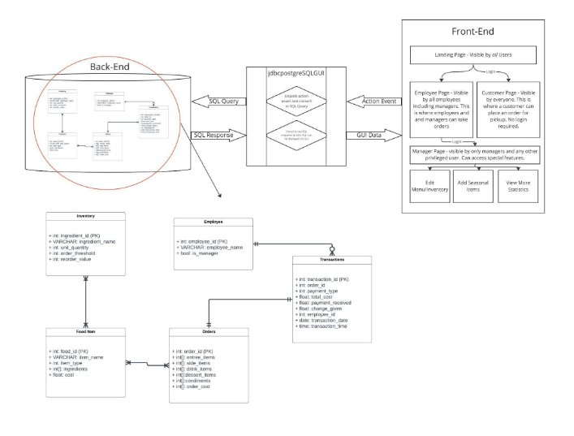
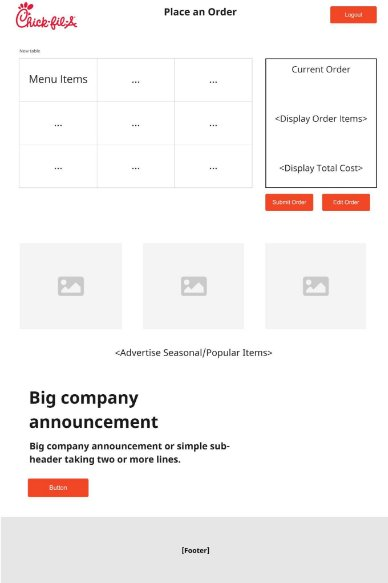
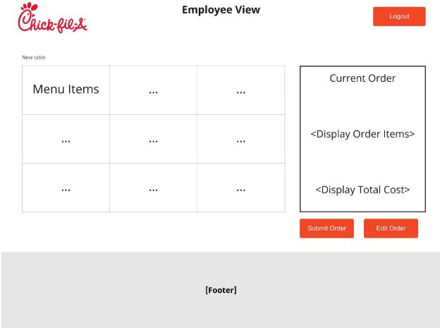
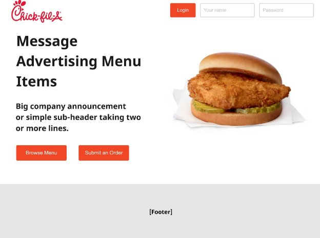
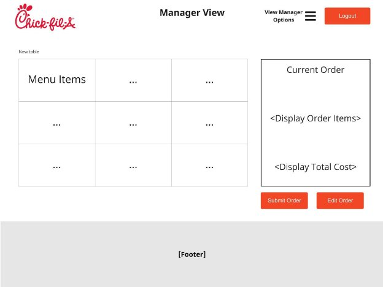

# Project 3: Chick-fil-A POS Front-End Focus

# Executive Summary
Our aim with this project is to create a fully functional point of sales system for the Chick-fil-a located on campus at the Memorial Student Center at Texas A&M University. It should be usable by customers and employees (including managers), with different features available for each type of user based on their needs. Our intent is for the GUI to be as intuitive as possible, making it easier than ever for Chick-fil-a to manage its inventory, costs, employee information, and menu. We intend on prioritizing accessibility in our design and will put special care into making sure we fulfill our user’s accessibility needs. 

This document contains some important information relevant to our plan for carrying out the execution of this project. We will start off with our different user personas which leads into some user stories demonstrating the different ways we intend for our users to interact with our product. After that, we will include our system diagram and interface diagram to map out our vision in terms of the front-end UI design and how all the back-end components are connected.  After this we have a project management section, showing our team roles and qualifications, development methodology, planned scope, and task breakdown and schedule for carrying out the project to completion throughout the 3 planned sprints.
# Personas and User Stories
1. **Customer**- The customer needs to be able to place their own orders with ease and choose a payment method that works best for them. The ordering system should be as accessible as possible, particularly to those with poor vision, such as our accessibility persona, Vishnu.
1. **Employee** - The employee needs to be able to place multiple orders for different customers. An employee should ideally log in to give them access to extra features regarding inventory.
1. **Manager** - The manager needs to be able to do anything that an employee can but also have access to extra menu management and inventory management features.

`	`**User Stories**

1. As a manager, I want to be able to edit the menu so that I can add or delete seasonal items, change the prices, and make other necessary changes.
1. As a manager, I want to edit the inventory so that I can keep track of what items sell well, what items need to be restocked, and add or delete items if necessary.
1. As a customer, I want to be able to place orders on the website GUI so that I am able to pick up the order at the restaurant. This functionality should include the ability for a user to choose a variety of menu items that are offered by the MSC Chick-fil-a and add them to an order which they can then submit to the database.
1. As an employee, I need to be able to take a customer's order using the menu front-end GUI. I need to be able to handle different payment methods.
1. As a user (employee, manager, or customer), I want to be able to have a landing page where all of my options are presented to me in an intuitive fashion. I want a clean and modern home page that allows me to log in as a manager or an employee (if I am one of those) and allows me to place customers or browse the menu as a customer.

# Proposed Work
## Solution Design
### System Diagram
Link to PDF: [System Design.pdf](https://drive.google.com/file/d/1cvMV9eRyCOhBMu4H-nHLBWTz_AUFdhNF/view?usp=sharing)

Link to Source: <https://miro.com/app/board/uXjVPUyWSLE=/?share_link_id=650323593332>

Our system design consists of three main components: the front-end, the middleman, and the backend. The front end will, obviously, contain all of the graphical components of our interface. We are planning to design this with HTML, CSS, and ReactJS. This is where all users will interact with the system. When a user clicks on a button (or performs any action event that in turn needs information from the DB), the system will shift control to an existing Java class “jdbpostgreSQLGUI.java”. This class processes requests from the front end and converts them into SQL requests. At this point, the translated request will send a query to the backend component which processes the request and sends a packet of data back to the middleman which converts the raw response data into human-readable data that can be displayed on the front end. The front end will consist of multiple pages. Primarily, one page for all users which they will view upon visiting, another page for customers where they may browse items and place an order, another page for employees where they will conduct employee tasks, and another page for managers only where they will be able to conduct all tasks an employee can plus the ability to access privileged features.
### Interface Diagram

Customer order page. On this page, a customer will be able to place an order. The table on the left will list categories of items (i.e., entrees, sides, drinks, condiments) which they can click on to bring up a more specific selection of items. Most likely, these options will also include an image. At the bottom of this page, we will also include promotions and other announcements which will possibly include an action item or two (clickable button).

Next,  we have the employee view. When an employee logs in, they will immediately be taken to this page which allows them to place an order in a similar fashion to how a customer orders (barring the promotional material).

` `This is the landing page. Every user will see this upon arrival at the site. A few promotional materials will appear and there will be an option to log in for employees and managers. If a customer wishes, they can either browse the menu and/or submit an order with the two respective red buttons.

Finally, we have the manager page. This is identical to the employee page, except the manager will have the option to click the “view manager options” dropdown menu which will, when clicked, present the manager with options to perform privileged actions such as viewing and editing the inventory.

Notice, each of these pages has a header with the Chick-fil-a logo and a footer (footer content TBD).
# Project Management
## Team Roles and Qualifications
Robbie will act as the project manager for the project. He is qualified to fill this position because he has experience working with Azure DevOps, the website the team is using to maintain the backlogs and burn-down charts. He will also have the technical responsibility of integrating the backend so that the website communicated with the database. He is qualified to complete that task due to his experience working with databases during past projects.

Cam will primarily work on back-end development and integration of already existing back-end code. Since this project is primarily a front-end project, Cam will also work closely with the front-end team to make sure tasks get done. Since Cam will be working on back-end as well, he will create integration tests and other end-to-end tests that make sure the application runs smoothly.

Uma will work primarily on the front-end, but will also participate in usability testing as well. She worked primarily on the front-end on the last iteration of this project as well, so in this iteration, she will focus on using different tools to build a new more modernized version, with similar functionality as our last iteration. 

Saddy will primarily work with front-end development. She worked with Uma on the front end on Project 2 and they worked well together. She will continue improving her front skills with Java React, but she also wants to improve her skills in back end development, so she will also be participating in back end to get a better understanding of a whole picture and be more versatile. 
## Development Methodology
As mentioned above, we will be using agile software development. For the last project, we have had weekly 15-40 minute meetings on Microsoft Teams. Those meetings were very productive, so we are going to continue this practice. We will continue attending the labs and take advantage of the Friday class period as a workday. Those meetings will include planning, reviewing, testing, and designing. 

We chose to use Azure DevOps. It gives us a great idea of visualization of all the tasks we need to do, what we are currently working on, and what we have already finished. It allows us to assign specific assignments and is very beneficial during our Scrum meetings. We are planning to run 4-6 Scrum meetings per sprint. Since each scrum is 2 weeks long, we are going to run 2-3 meetings per week. We can use Friday as one of the Scrum meetings. Those meetings should allow us to get an even better idea of where the team stands and what each person has been working on and what struggles they are having. 

Additionally, we decided to have deadlines before the actual deadlines. For example, if the deadline for the first phase is due on Wednesday, the team deadline is going to be Sunday. This allows us to hold ourselves accountable and gives us 3 extra days if one is not finished or we need to face any troubleshooting. 
## Planned Scope
The publicly hosted website that the team is creating will allow for three main types of users (customers, servers, and managers) to navigate the Chick-Fil-A point-of-sale system. Customers will be able to place an order, translate text present on the site utilizing Google Translate, and determine the delivery time and distance using Google Maps. Servers will be able to log in using OAuth login, as well as place and cancel orders. Managers will have the same capabilities as a server in addition to the ability to edit and analyze the inventory and menu. One fallback goal for the project is to not have separate interfaces based on the user type, but rather one universal view. Another fallback goal is to have a working interface without implementing the OAuth login, Google Maps, or Google Translate web services. Our stretch goals are to make a mobile app for the customer interface specifically and to implement a payment service such as PayPal to complete transactions.
## Task Breakdown and Scheduling

Here is an example of the Sprint 1 timeline. While we do not have all the sprints broken down with assignments, this is a general idea of how they are going to be scheduled. Each story has the most important tasks that need to be completed before we can move on to the next stage alongside the team member assigned to it. Upon completion, each team member can choose to update the status to working (active), resolved, and/or closed. Based on that, a team member can also update the remaining work and how much was completed.  Using Agile will help us to be flexible when and if needed. If we can finish all the tasks from Sprint 1 and need a few additional tasks completed before moving on, we can add/remove them as needed. 

# References
- <https://order.chick-fil-a.com/menu>
- https://www.w3.org/standards/webdesign/accessibility

Appendix 1: Product Backlog

Appendix 2: Initial Product Burn-down Chart

Appendix 3: Initial Sprint Backlog

-----

